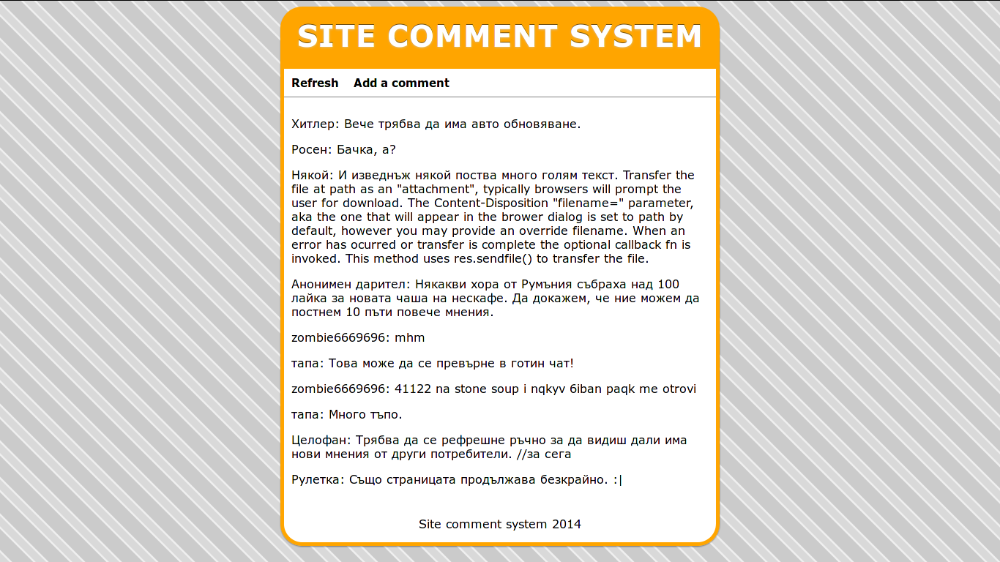

Someone-stole-my-sweetroll
==========================
A simple site comment and opinion system with node.js and JQuery.
It is using [express](http://expressjs.com/) and [Jade](http://jade-lang.com/) as a template engine.

Installation
-------------
1. Have [node.js](http://nodejs.org/) and [npm](https://www.npmjs.org/)
2. Clone this repo
3. Run `npm install` inside it
4. Edit the server IP and port inside app.js
  - Remove the IP if you want to use localhost
5. Run `node app.js`

Screenshot
----------

